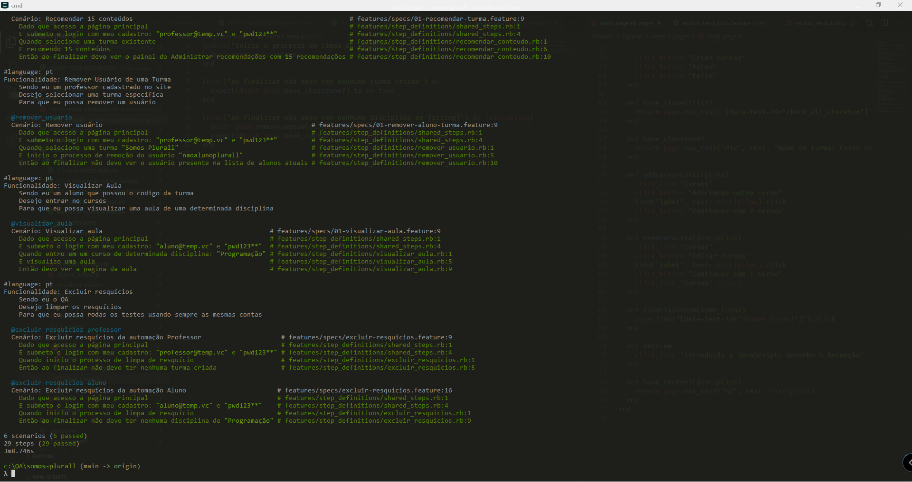
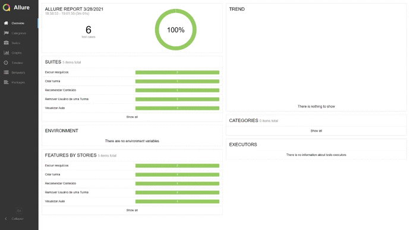

<div align="center">


<br/>
<br/>
<a href="https://www.linkedin.com/in/asilvadev/">

</a>

</div>
<br/>

## 👨🏽‍💻 Technologies

<p align="left">

<br/>


<br/>


</P>
<br/>

## ⚠️ Informações Importantes

```
Tenha certeza que possui o Ruby instalado em seu computador

Para verificar (via cmd)
ruby -v

Caso necessite:
https://rubyinstaller.org/downloads/
```

```
Por padrão os testes da *Automação Web* rodam via cucumber em chrome_headless
O projeto suporta outros tipos de navegadores
É possível altera-lo no arquivo cucumber.yml

https://github.com/mozilla/geckodriver
https://chromedriver.chromium.org/downloads
```

```
A API do sistema foi DESCONTINUADA, logo não foi usado HTTParty+Rspec para solucionar alguns casos.

INFO:
https://github.com/Khan/khan-api
```

```
⚠️ Atenção ⚠️

Para usar o jenkins é preciso dar 'build' no docker ruby-web-agent que se encontra na pasta infra
Usando sua conta pessoal do Docker

Altere o arquivo Jenkins
00rion/ruby-web-agent → seu_usuario/ruby-web-agent
```

# Automação Web

## 🛠️ Steps

```
Ruby + Cucumber + Capybara + AllureFramework

git clone https://github.com/asilvadev/somos-plurall.git

cd somos-plurall
bundle install
cucumber
```

## 📷 Screenshots

```
↓ Cucumber output via terminal ↓
```



```
Para visualizar o report no Allure execute no terminal
allure serve logs/

↓ Allure report output via terminal ↓
```



@asilvadev
